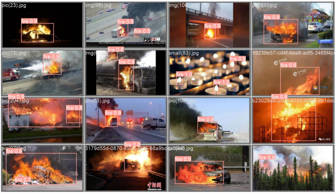
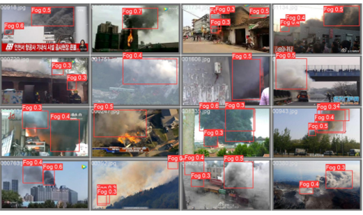

# Fire-Fog-dectection

<<<<<<< HEAD
The repository contains the  project for course "Image Processing and Computer Vision" in the undergraduate program of Artificial Intelligence at [Huazhong University of Science and Technology](http://english.aia.hust.edu.cn/). It is maintained by Mr. [Zonghe Shao](zhshao17.github.io) and Ms. Xin Yi.

## Method
YOLOv8 based on Deformable Attention Transformer (DAT)

## Datasets

+ [fire Computer Vision Project](https://universe.roboflow.com/custom-thxhn/fire-wrpgm)
+ [Smoke Dataset Computer Vision Project](https://universe.roboflow.com/xml2yolo-a1c9q/smoke-dataset-otsaj)
+ [fire_smoke_datasets](https://github.com/liuzifan/fire_smoke_datasets)
+ [A dataset for fire and smoke object detection](https://github.com/siyuanwu/DFS-FIRE-SMOKE-Dataset)

## Result
+ Fire

    

+ Fog

    

## Other
If you have any inquiries regarding the repository, please feel free to reach out to us at the following email address: [zongheshao17@gmail.com](mailto:zongheshao17@gmail.com).
=======
The repository contains the Project in Computer Vision Course in the undergraduate program of Artificial Intelligence at [Huazhong University of Science and Technology](http://english.aia.hust.edu.cn/). It is maintained by Mr. [Zonghe Shao](https://zhshao17.github.io/) and Ms. Xin Yi.
>>>>>>> 5c3450af09695a070155202b334833a99e7f8519
